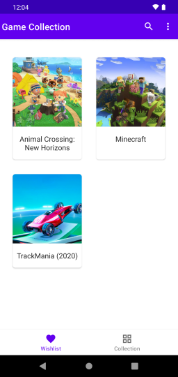
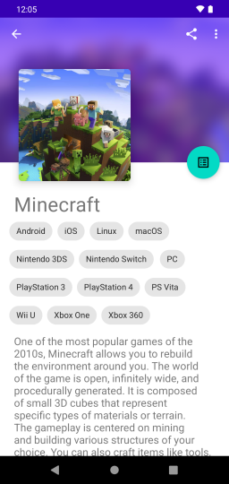
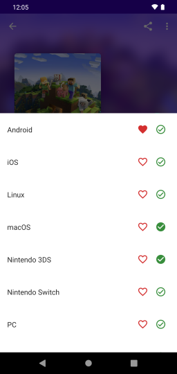

# Game Collection





A demo application made using a modern Android stack, inspired by [Android Sunflower](https://github.com/android/sunflower). It's an application to manage a video-game collection, supporting both storing a list of "owned games", and a "wishlist".

Note: Due to the "demo" nature of the application, it's feature-set is quite basic. While it's usable as a very basic collection manager, it's recommended that to instead use one of the other several feature-complete applications for managing a video-game collection.

## Download
---

Download the [latest release](https://github.com/trigonated/GameCollection/releases/download/v1.0/GameCollection-demo_1_0.apk) from the releases page.

Note: You might need to enable [installation of apps from unknown sources](https://www.wikihow.com/Allow-Apps-from-Unknown-Sources-on-Android) before you can install this application.

Note: The download link listed above points to a "demo" version of the app, which comes with some games already on the collection. You can find non-demo builds on the [releases page](https://github.com/trigonated/GameCollection/releases). 

## Building from source
---

This is a standard gradle project created using Android Studio. Check the [developer guides](https://developer.android.com/guide/) for additional information on how to build projects like this one.

### RAWG API key

This project uses the [RAWG](https://rawg.io/) API to obtain information about videogames. Since the project's source code does not include an API key, you will need to obtain a [free API key](https://rawg.io/apidocs) and insert it on the app module's ```build.gradle``` file:

On the line:

```buildConfigField("String", "RAWG_API_KEY", "\"" + <INSERT_RAWG_API_KEY_HERE> + "\"")```

Replace ```<INSERT_RAWG_API_KEY_HERE>``` with your API key so that it looks like:

```buildConfigField("String", "RAWG_API_KEY", "\"" + "1234567890abcdefghijklmnopqrstuv" + "\"")```

## Stack
---

 * AppCompat
 * Material Design Components
 * Kotlin Flows and Coroutines
 * Lifecycle (ViewModel)
 * Work
 * Navigation
 * Retrofit
 * Room
 * Glide
 * Hilt (Dagger)
